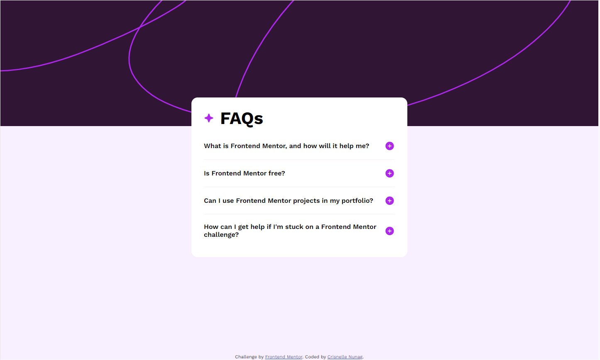

# Frontend Mentor - FAQ accordion solution

This is a solution to the [FAQ accordion challenge on Frontend Mentor](https://www.frontendmentor.io/challenges/faq-accordion-wyfFdeBwBz). Frontend Mentor challenges help you improve your coding skills by building realistic projects. 

## Table of contents

- [Overview](#overview)
  - [The challenge](#the-challenge)
  - [Screenshot](#screenshot)
  - [Links](#links)
- [My process](#my-process)
  - [Built with](#built-with)
  - [Continued development](#continued-development)

## Overview

### The challenge

Users should be able to:

- Hide/Show the answer to a question when the question is clicked
- Navigate the questions and hide/show answers using keyboard navigation alone
- View the optimal layout for the interface depending on their device's screen size
- See hover and focus states for all interactive elements on the page

### Screenshot
Collapsed (Desktop)

Expanded (Desktop)

Collapsed (Mobile)
  

Expanded (Mobile)
  

### Links

- Solution URL: [https://github.com/erineul/fms-faq-accordion](https://github.com/erineul/fms-faq-accordion)
- Live Site URL: [https://fms-faq-accordion.vercel.app/](https://fms-faq-accordion.vercel.app/)

## My process

### Built with

- Semantic HTML5 markup
- CSS custom properties
- Flexbox

### Continued development

Currently this was a bit challenging for me since it's been a while since I've coded and I am not really familiar with Javascript. It took me a while to complete this challenge since I know the solution using JQuery but I really wanted to improve in Vanilla JS and in the future, I would like to try this challenge again using React.
